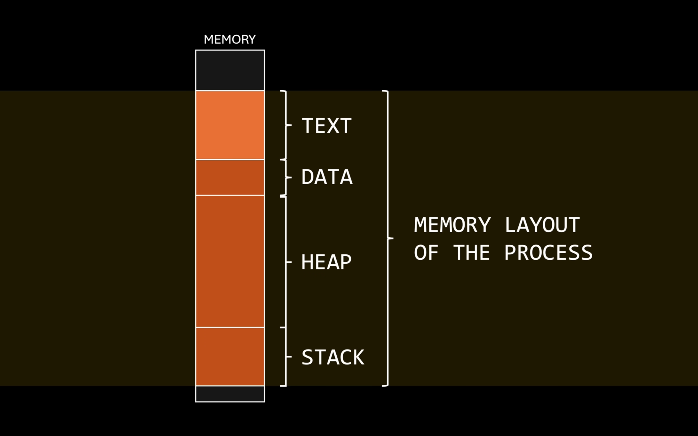

Explain all the technical terms with their level of abstraction - logical, physical.

Eg: fork, spawn, process

What is multi-process architecture?

An application is composed of multiple processes running in the background. Their interaction (communication) gives rise to the (emergent) phenomenon we see (application). A user only interact with the application via GUI / cmd.

Applications, once launched can programmatically spawn multiple processes at any point during their execution.

How does a parent process p1 create a child process p2?

To start a new process, the new process's executable code (binary) needs to be written to the address space so that the cpu can start executing it step by step. The complication is that one process is isolated from other processes via (memory virtualization of address space -- verify this and add more detail to explain this clearly with examples), and therefore any other memory is completely inaccessible to this p1?

And so although p1 can read p2's executable code in its own address space, it cannot place this in any other address space outside of it.

More concretely, here is why a process in user space cannot create another process in the user space:

1. Allocate a PID form the global PID namespace.
2. Create a kernel process object (Process control block)
3. Insert the process into kernel scheduler run queues 
4. Allocate and initialize page tables for a new address space
5. Program the MMu with those page tables
6. Allocate kernel stacks for the new execution context
7. Initialize CPU context (register frame, privelege level, flags)
8. Assign security credentials (UID/GID, token, capabilities)
9. Attach the process to namespaces / job objects / cgroups
10. Set up signal / exception / APC delivery structures
11. Duplicate or initialize file descriptor tables
12. Register the process with resource accounting and limits
13. Link parent / child relationships in the process tree
14. Make the process visible to kernel and other processes
15. Allow the CPU to context switch into the new process
16. Expose the process through kernel APIs (/proc, task lists, handles)

Hence process creation must go thorugh a system call. System calls are a Kernel provided API interface for user process to do things and are exposed as C/C++ functions that programmers can use: : 
1. Process Control : create, terminate, load/execute, get/set process attributes, wait event, signal event, allocate memory, free memory : fork(), exit(), wait()
2. Device Management : request device, release device, read / write / reposition, get / set device attributes, logically attach / detach devices. ioctl(), read(), write()
3. File Management : CRUD, get / set file attributes. open(), read(), write(), close()
4. Comms : create / delete comms, send / receive messages, attach / detach remote devices
5. Info Maint : time, date getpid()
6. Protections : get file security  chmod(), chown()

These are functions that are invoked in the user space but executed in the kernel space, once done, exeuction returns back to user mode.

Fork in a unix-like OS (macOS, Linux distros) first clones the parent process completely (deep copy with a pid and page table exception), including the current execution state and CPU state.

The entire address space is duplicated - text section, data section, stack and heap.

The process context (almost) is duplicates as well and this includes the cpu state (instruction pointer, stack pointer, register states, etc). This means that the moment fork is called there are two processes running from the exact next instruction.   

The next system call is execv(path, argv) where path is the path of the executable and argv is an array of c strings that give the flags and arguments.
Execv replaces or resets the calling process entirely. SInce the program counter is reset, it now again points to the first instruction in the program.

How do we ensure that only the child process calls execv?
fork returns the pid of the calling process, but for a child process it always returns 0. This is how a process can know if it is a child or not.

Posix compliant systems provide a system call called posix_spawn() that internally uses fork and makes the child process called execve.

# Memory
We as CS students operate at a hihger level of abstraction where we can see memory as an array of addresses where 1 byte of information can be stored.
Any data or instruction that the CPU is going to execute needs to be loaded into main memory.

Concurrency is where multiple programs share cpu time with scheduling algoritms determining the fair CPU usage.

Learn about paging and memory management with MMU.

Also learn about how program executes, with the diefferent memory sections and cpu states.

this is also called the "address space". The text section is fixed as it contains the executable instruction of the program. Its the heap and stack which keep on growing and shrinking during a processe's execution.

For compiled languages like C, C++ and Rust, the compilation process produces an executable. 
For interpreted languages like Python and Javascript, its the python.exe interpreter that runs, while the .py source code is simply a text file stored in the heap of the interpreter.

We can make the difference between compiler and assembler here a bit more clear.

Two serve concurrent user programs, the OS has a scheduler and dispatcher that allow 1 process to execute on a CPU at once.
Concurreny requires saving the cpu execution state or context (all registers, flags, IP, Stack pointer etc) such that the state can be restored. This is also called context switch. 

In essence a process is a hetereogenous collection called a context (isolated from other processes) that comprises of:
1. CPU execution state
2. Address Space (memory layout)
3. Open files
4. I/O devices

This is why we call it context switching.

THe OS uses Process Control Block to keep track of every running process.
1. pid
2. state (running, new, terminated, ready, waiting)
3. program_counter (is this the same as instruction pointer?)
4. list of general purpose registers
5. stack pointer?
6. flags
7. index registers
8. memory_limits (address space start and end, maybe page tables?)
9. io_devices
10. open_files
11. pointer to parent's PCB
12. pointer to children's PCB

Stuff 3-7 is the cpu state of the process.
This PCB object is what captures the entire running state of the program with accounting metadate that can be scheduled.