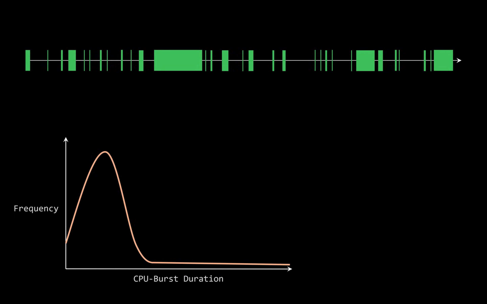
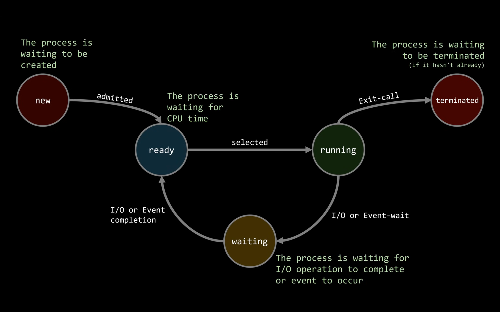

Scheduling is the problem of scheduling tasks (abstraction of threads processes) on CPU cores for a certain criteria.
This criteria could be task related (response time, queueing time, turnaround time), could be CPU related (Utilization), or overall system (troughput).

Simplest : FCFS policy.
Each PCB enters a FIFO queue (primitives push and pop). The CPU finishes esecuting task t before going to task t+1.
The problem is, what about daemons (that run indeefinitely like a server or listener), or tasks that are I/O bound (waits, blocked, high cpu idle times.). These periods of CPU idle times while wainting for I/O are called I/O bursts, and the other, CPU burst.

A lot of middle bursts, byt very few long bursts.

Wait times to CPU times could be anywhere from 20:80 to 80:20.

1. New : Executable is loading into adress space.
2. Ready : Ready to execute instrucitons on a CPU.
3. Running : CPU actively executing intr.
4. Waiting : Waiting for I/O or event (network packets, user keystrokes)
5. Terminated : Execution completed. (could be subdivided to finer resolution - terminating (syscall to exit issued bu resource is in the progressively being freed up) vs terminated)

All tasks cycle between these states, with some like servers (daemons) infinitely cycle without terminating.

New, Ready, Waiting and terminated become queues.

The dispatcher performs the context switch by taking the first element from the head of the ready (PCB obtained on ready.pop) and starts CPU execution "running".

Scheduler determines which task to run next according to a policy (minimize / maximize criteria) by managin the ready queue, while the dispatcher actualizes the decisions of the scheduler to perform the context switch, which incurs a latency cost called dispatch latency.

Beacuse tasks have states, the scheduler is not actually managing PCBs but PCB-state tuples (it is scheduling the next CPU burst of a particula PCB)

FCFS causes a convoy effect (where a CPU bound task blocks CPU for I/O bound tasks like cars blocked by a slow moving truck)

SJF (shortest job first): Scheduler schedules the next ready task with the shorted predicted CPU burst. This can be implemented by a priority queue with the CPU burst as a priority. This is provably optimal and gives the lowest waiting time among processes.

The catch is that prediciton of the actual cpu burst interval is obvioulsy error prone, and so we cannot tbe truly optimal.
And so we use a simple ETS (exponential time smoothning) for a running avg.

Pre-emption:
There arises a scenario when the currently running tasks's predicted CPU burst time remaining (predicted total - actual time spent executing) > than the predicted cpu burst of the next process in prioirty queues (ready). Can the scheduler interrupt the execution of the currently running process and let the dispatcher context switch to the other process? If yes, then this is called pre-emptive scheduling.

Most modern OSs implement pre-emptive scheduling. This solves the infintie loop problem.

However, this can lead to starvation when a cpu-bound taks has to wait indefinitely in queue over other light tasks.

Round Robin:
A time limit of say 100ms is defined (called a time quantum) that interrupts a runnning process and forces a context switch to the next process, this allows a fair amount of processing time (100ms) to be allocated to all the processes in a running queue one at a time, fairly. This timer is built in the H/W itself.

This allows the nth task in the queue to wait for atmost n-1*q amount of time before getting its fair share (at most q of CPU time).

If q is too large, the CPU burst of a generic task ends and I/O waits cause idle times causing RR to behave similarly to FCFS. Too low a quantum will cause context switching overheads to execeed.

Priority Scheduling:
Higher propiryt processes are ascheduled readily than lower prioirty processes (but this can again cause starvation).

This can be solved using aging, that is, increasing the prioirty of watining processes.

Finally, we can divide the ready queue into different queues based on priority (also match them by the process type) and use different scheduling algos for each to provide a better match.

This is called multi-level queue scheduling.

However, the priopirty of a process is not a static number and should change depenfing on the current operations and user interaction happening (and so should be dynamic). this led to multi-level feedback queue scheduling.
